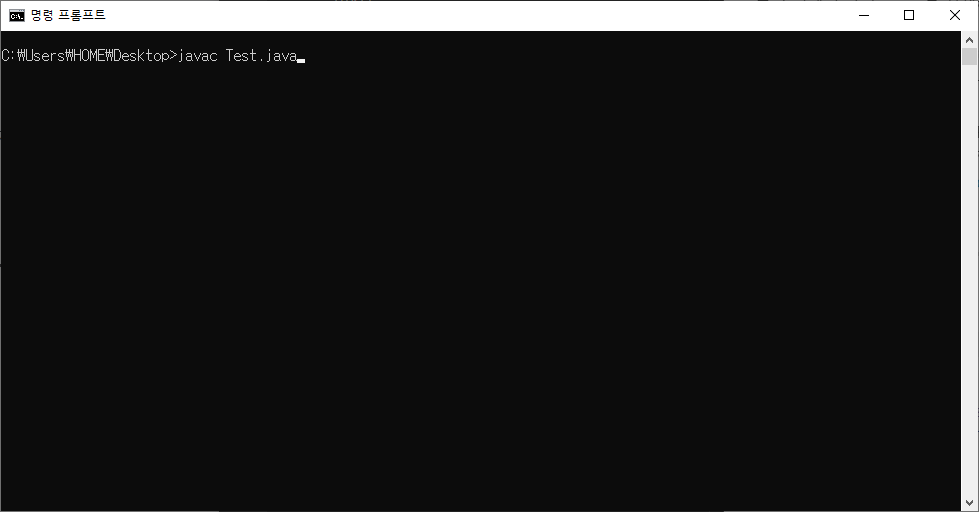
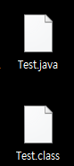
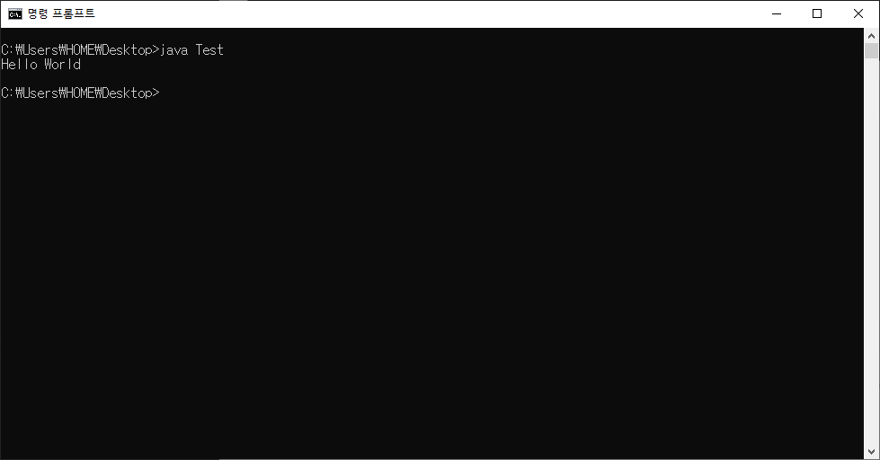
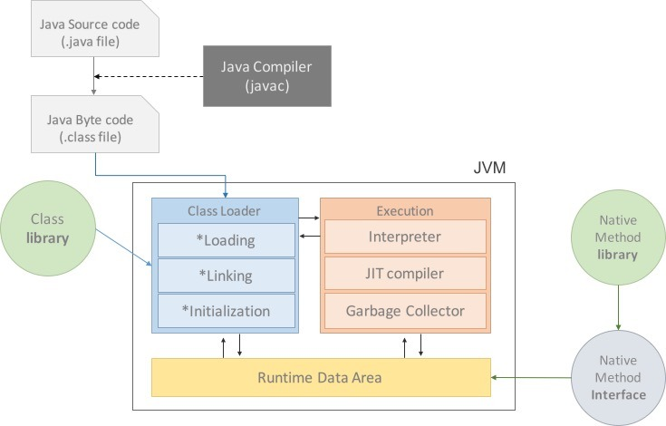

## 1주차 - JVM은 무엇이며 자바 코드는 어떻게 실행하는 것인가.
- - -
### JVM이란 무엇인가?
**JVM은 자바 바이트코드를 실행할 수 있는 주체이다.** 일반적으로 인터프리터나 JIT컴파일 방식으로 다른 컴퓨터 위에서 바이트코드를 실행할 수 있도록 구현되어 있다.

자바 바이트코드는 플랫폼에 독립적이며 모든 자바 가상 머신은 자바 가상 머신 규격에 정의된 대로 자바 바이트코드를 실행한다.

따라서 모든 자바 프로그램은 CPU나 운영체제(OS)의 종류와 무관하게 동일하게 동작할 것을 보장한다.
> 내용 출처 : <https://ko.wikipedia.org/wiki/%EC%9E%90%EB%B0%94_%EA%B0%80%EC%83%81_%EB%A8%B8%EC%8B%A0>
- - -
### 컴파일 하는 방법
>Test.java
```java
public class Test {
    public static void main(String[] args) {
        System.out.println("Hello World");
        }
    }
```

```
cmd > javac Test.java [자바파일이름.java]
```

```
Test.class 파일 생성된다.
```
- - -
### 실행하는 방법

```
cmd > java Test (class 파일 이름만!)
Test.class 파일을 실행한다.
```
- - -
### 바이트코드란 무엇인가
자바 바이트코드(Java bytecode)는 자바 가상 머신이 실행하는 명령어의 형태이다. 

각각의 바이트코드는 1바이트로 구성되지만 몇 개의 파라미터가 사용되는 경우가 있어 총 몇 바이트로 구성되는 경우가 있다. 

256개의 명령코드 모두가 사용되지는 않는다.
> 내용 출처 : <https://ko.wikipedia.org/wiki/%EC%9E%90%EB%B0%94_%EB%B0%94%EC%9D%B4%ED%8A%B8%EC%BD%94%EB%93%9C>

자바 바이트코드는 JVM(Java virtual machine)이 실행하는 명령어 집합이다. 컴파일하면 생성되는 .class 파일이 바이트코드를 담고 있습니다.

컴파일을 통해 생성된 바이트코드 파일(.class)들은 OS나 개발환경에 관계없이 **같은 명령어 집합**을 사용하며, 이것이 자바의 크로스 플랫폼 동작을 가능하게 해주는 부분입니다.
- - -
### JIT 컴파일러란 무엇이며 어떻게 동작하는지
JIT 컴파일(just-in-time compilation) 또는 동적 번역(dynamic translation)은 프로그램을 실제 실행하는 시점에 기계어로 번역하는 컴파일 기법이다.

전통적인 입장에서 컴퓨터 프로그램을 만드는 방법은 두 가지가 있는데, 인터프리트 방식과 정적 컴파일 방식으로 나눌 수 있다. 

이 중 인터프리트 방식은 실행 중 프로그래밍 언어를 읽어가면서 해당 기능에 대응하는 기계어 코드를 실행하며, 반면 정적 컴파일은 실행하기 전에 프로그램 코드를 기계어로 번역한다.

JIT 컴파일러는 두 가지의 방식을 혼합한 방식으로 생각할 수 있는데, 실행 시점에서 인터프리트 방식으로 기계어 코드를 생성하면서 **그 코드를 캐싱하여, 같은 함수가 여러 번 불릴 때 매번 기계어 코드를 생성하는 것을 방지한다.**

최근의 자바 가상 머신(JVM)과 .NET, V8(node.js)에서는 JIT 컴파일을 지원한다. 즉, 자바 컴파일러가 자바 프로그램 코드를 바이트코드로 변환한 다음, **실제 바이트코드를 실행하는 시점에서 자바 가상 머신이 바이트코드를 JIT 컴파일을 통해 기계어로 변환한다.**
> 내용 출처 : <https://ko.wikipedia.org/wiki/JIT_%EC%BB%B4%ED%8C%8C%EC%9D%BC>
- - -
### JVM 구성 요소

> JVM 구성

###### Class Loader(클래스로더)
JVM내로 클래스(.class파일)을 로드하고, 링크를 통해 배치하는 작업을 수행하는 모듈, Runtime 시에 동적으로 클래스를 로드한다. jar파일 내 저장된 클래스들을 JVM위에 탑재, 사용하지 않는 클래스들은 메모리에서 삭제한다. 

자바는 동적코드, 컴파일 타임이 아니라 런타임에 참조한다. 즉, 클래스를 처음으로 참조할때, 해당 클래슬르 로드하고 링크한다는 것이다.
###### Excution Engine(실행엔진)
클래스를 실행시키는 역할이다. 클래스 로더가 JVM내의 런타임 데이터 영역에 바이트 코드를 배치시키고, 이것은 실행엔진에 의해 실행된다. 

자바 바이트코드는 기계가 바로 수행할 수 있는 언어보다는 비교적 인간이 보기 편한 형태로 기술된 것이다. 

그래서 실행 엔진은 이와 같은 바이트코드를 실제로 JVM내부에서 기계가 실행할 수 있는 형태로 변경한다.
###### Interpreter(인터프리터)
실행 엔진은 자바 바이트 코드를 명령어 단위로 읽어서 실행한다. 하지만 이 방식은 인터프리터 언어의 단점을 그대로 갖고 있다. 한 줄 씩 수행하기 때문에 느리다는 것이다.
###### JIT(Junt-In-Time)
인터프리터 방식의 단점을 보완하기 위해 도입된 JIT 컴파일러, 인터프리터 방식으로 실행하다가 적절한 시점에 바이트코드 전체를 컴파일하여 네이티브 코드로 변경하고, 이후에는 더 이상 인터프리팅 하지 않고 네이티브 코드로 직접 실행한느 방식이다.

네이티브 코드는 캐시에 보관하기 때문에 한 번 컴파일된 코드는 빠르게 수행하게 된다.

JIT 컴파일러를 사용하는 JVM들은 내부적으로 해당 메서드가 얼마나 자주 수행되는지 체크하고, 일정 정도를 넘을 때에만 컴파일을 수행한다.

### RunTime Data Area

> 이미지 출처 : <https://asfirstalways.tistory.com/158>
###### PC Registers
PC Registers는 Thread가 생성될 때 마다 생기는 공간으로 Thread가 어떠한 명령을 실하게 될지에 대한 부분을 기록한다.

JVM은 Stack 기반으로 동작하는데, JVM은 CPU에 직접 Instruction을 수행하지 않고, Stack에서 Operand를 뽑아내 이를 별도의 메모리 공간에 저장하는 방식을 취하는데, 이러한 메모리 공간을 PC Registers라고 한다.
###### Method Area (= Class Area = Static Area)
프로그램 실행 중 클래스가 사용되면 JVM은 해당 클래스 파일을 읽어서 분석하여 클래스의 인스턴스 변수, 메서드 등을 Method Area에 저장한다. 이 떄 클래스 변수도 함께 생성된다.

프로그램이 실행되면 모든 코드가 저장되어 있는 상태가 아니다. new 키워드를 통해 객체가 동적으로 생성되기 이전에는 텍스트일 뿐이다.

객체 생성 후에 메서드를 실행하게 되며 해당 클래스 코드에 대한 정보를 Method Area에 저장하게 된다.

*저장되는 정보의 종류*
> 1. Field Information
멤버변수의 이름, 데이터 타입, 접근 제어자에 대한 정보
> 2. Method information
메서드의 이름, 리턴타입, 매개변수, 접근 제어자에 대한 정보
> 3. Type Information
class인지 interface인지의 여부 저장, Type의 속성, 전체 이름, super class의 전체 이름
###### Heap
사용자가 관리하는 인스턴스가 생성되는 공간으로 객체를 동적으로 생성하면 인스턴스가 Heap 영역의 메모리에 할당되어 사용되어진다. 

프로그램은 시작될 때 미리 Heap영역을 많이 할당해 놓으며 인스턴스와 인스턴스 변수가 젖아된다. 

레퍼런스 변수의 경우 Heap에 인스턴스가 저장 되는것이 아니라 포인터가 저장된다.
- - -
### JDK와 JRE의 차이
###### JDK
JDK는 Java Runtime Environment (JRE), 인터프리터 / 로더 (java), 컴파일러 (javac), 아카이버 (jar), 문서화 된 문서 generator (javadoc) 및 Java 개발에 필요한 기타 도구를 제공합니다. 
Java 애플릿 및 해당 응용 프로그램을 초기화하기위한 프로그램 개발 환경입니다. 

운영 체제 계층의 최상위에있는 런타임 구성 요소를 가지고 있습니다. 또한 Java 언어로 작성된 애플릿 및 응용 프로그램을 프로그래밍, 개발, 컴파일, 디버깅 및 실행하는 데 필수적인 도구입니다.

> ###### JDK 구성요소
> - appletviewer -이 도구는 웹 브라우저없이 Java 애플릿을 실행하고 디버그하는 데 사용할 수 있습니다.
> - apt - 주석 처리 툴
> - java - Java 어플리케이션의 로더. 이 도구는 인터프리터이며 javac 컴파일러가 생성 한 클래스 파일을 해석 할 수 있습니다.
> - javac - 소스 코드를 Java 바이트 코드로 변환하는 Java 컴파일러입니다.
> - javadoc - 소스 코드 주석으로부터 문서를 자동으로 생성하는 문서 생성기.
> - jar - 관련 클래스 라이브러리를 단일 JAR 파일로 패키징하는 아카이버. 이 도구는 JAR 파일을 관리하는데도 도움이됩니다.

###### JRE
JRE (Java RTE로도 작성)는 설치된 Java Runtime Environment 구성 요소와 응용 프로그램 및 Java 애플릿에만 적용됩니다.
Mac, Windows 및 UNIX를 포함한 여러 컴퓨터 플랫폼에 적용 할 수 있습니다. JRE는 조건 지향적입니다. 

즉, JRE가 컴퓨터에 설치되어 있지 않으면 Java 프로그램이 각 컴퓨터 운영 체제에서 인식되지 않을 수 있습니다. 

JRE 소프트웨어는 Java 프로그램을 실행할 수있는 런타임 환경을 제공합니다. 독립 실행 형 환경과 웹 브라우저 플러그인에서 사용할 수 있으므로 Java 애플릿을 웹 브라우저에서 실행할 수 있습니다

최신 JRE 1.0은 다양한 클래스와 패키지로 발전했습니다. 이것들은 핵심 라이브러리에 포함되어 있으며 J2SE (Java 2 Platform, Standard Edition)에서 몇백 개에서 수천 개로 증가했습니다.

> ###### JRE 구성요소
> - Java Virtual Machine (JVM) : Java HotSpot Client 및 Server Virtual Machines를 포함합니다.
> - 사용자 인터페이스 툴킷 : AWT (Abstract Window Toolkit), Swing, Java 2D, 액세스 가능성, 이미지 I / O, 인쇄 서비스, 사운드, 드래그 앤 드롭 (DnD) 및 입력 메소드를 포함합니다.
> - 통합 라이브러리 : IDL (Interface Definition Language), JDBC (Java Database Connectivity), JNDI (Java Naming and Directory Interface), RMI (Remote Method Invocation), RMI-IIOP (Remote Method Invocation over Internet Protocol) 및 스크립팅.
> - 기타 기본 라이브러리 : 국제 지원, 입출력 (I / O), 확장 메커니즘, Bean, Java Management Extensions (JMX), Java Native Interface (JNI), 수학, 네트워킹, 재정의 메커니즘, 보안, XML 처리 (XML JAXP).
> - Lang 및 util 기본 라이브러리 : lang 및 util, 관리, 버전 관리, zip, 악기, 반영, 컬렉션, 동시성 유틸리티, JAR (Java Archive), 로깅, 기본 설정 API, Ref 객체 및 정규 표현식을 포함합니다

### 참고 링크
> <https://asfirstalways.tistory.com/158>
> <https://d2.naver.com/helloworld/1230>
> <https://medium.com/@ahn428/java-jvm-java-virtual-machine-jre-java-runtime-environment-jdk-java-developement-kit-fed91def1d6f>
> <https://www.holaxprogramming.com/2013/07/16/java-jvm-runtime-data-area/>